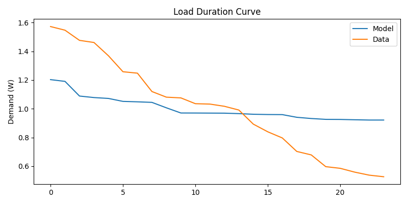
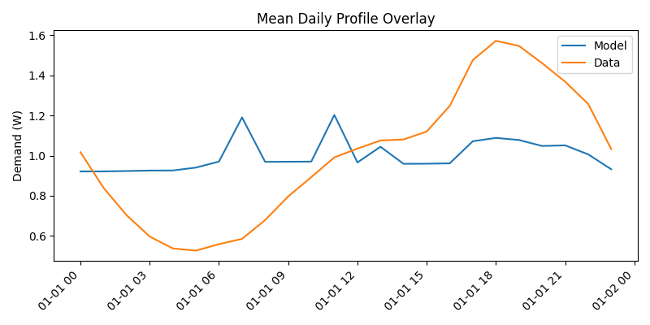
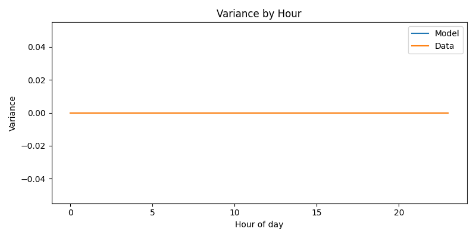
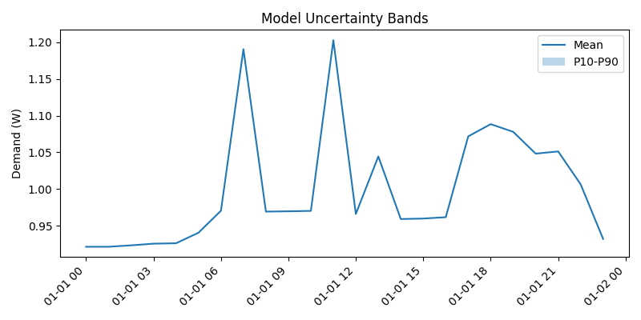

# Validation Report — Model v3

## Validation Type

- classification: internal aggregate diagnostic
- interpretation: Normalized aggregate shape diagnostic against an explicitly configured aggregate reference. Do not use LCL here as thesis-facing validation because LCL is the input load-shape source.

## Runtime Context

- canonical thesis config: `config/model_v3/model_v3_thesis.yaml`
- canonical thesis runtime: reference year `2023`, `30` households, `simulation.max_steps: null`, climate disabled
- report reference year: `2023`
- report cohort households: `30`
- report minimum households: `30`
- report max steps: `24`
- quick mode: `False`
- climate enabled: `True`
- simulated/aligned model steps: `24`

## Artifact Interpretation

- This artifact is horizon-limited by `simulation.max_steps`.
- It covers fewer than a full non-leap-year hourly horizon.
- Normalized aggregate metrics cannot support absolute calibration claims; read the threshold table for overall status.

## Alignment

- model resolution (s): 3600
- data resolution (s): 1800
- target resolution (s): 3600
- matched timestamps: 24

## Mean accuracy

- MBE: -0.000000
- MAE: 0.266824
- RMSE: 0.308500
- CVRMSE: 30.849976

## Variance realism

- variance_model: 0.006532
- variance_data: 0.112791
- CV_model: 0.080818
- CV_data: 0.335843
- Levene_statistic: 27.913811
- Levene_p_value: 0.000003

## Distribution realism

- Anderson_Darling_statistic: 3.538986
- P10_error: 0.357168
- P50_error: -0.055345
- P90_error: -0.386217
- LDC plot: 

## Temporal structure

- Pearson_correlation: 0.368658
- autocorrelation_difference_mean: 0.838322
- autocorrelation_difference_max: 1.941726
- peak_timing_error_hours: 7.000000

## Event-based validation

- seasonal_shape_MAE: 0.000000
- seasonal_peak_month_error: 0.000000
- peak_day_error: 0.369369
- peak_MAE_kW: 0.000000
- extreme_condition_error: 0.000000

## Validation vs Literature Thresholds

| Metric | Model | Acceptable | Good | Status |
| --- | ---: | ---: | ---: | --- |
| MBE monthly | -0.000 | <= 0.050 | - | PASS |
| CVRMSE monthly | 0.000 | <= 0.150 | - | PASS |
| MBE hourly | -0.000 | <= 0.100 | <= 0.050 | PASS |
| CVRMSE hourly | 0.308 | <= 0.300 | <= 0.200 | FAIL |
| Peak MAE (kW) | 0.000 | <= 0.200 | <= 0.100 | PASS |
| Quantile error P10 (kW) | 0.000 | <= 0.200 | <= 0.100 | PASS |
| Quantile error P90 (kW) | 0.000 | <= 0.200 | <= 0.100 | PASS |
| Overall | FAIL | all critical pass | - | FAIL |

## Visualisations

- Mean daily profile overlay: 
- Load duration curve: 
- Variance by hour: 
- Uncertainty bands: 

## Validation Independence / Data Role

- dataset_independent: False
- partial_overlap: True
- validation_independence: weak
- implications: Validation uses the same dataset path as at least one model input, so the result is not independent.

## Normalization / Calibration Caveat

Both model and reference series are divided by their own means before metric calculation. The result is a shape comparison only and does not validate annual electricity totals or household scaling.

## What this script does not validate

This script validates normalized aggregate demand shape, seasonal variation, and peak timing. It does not validate appliance attribution or absolute household totals.
