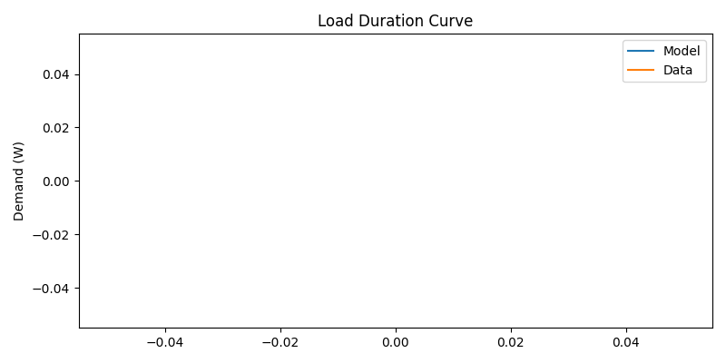
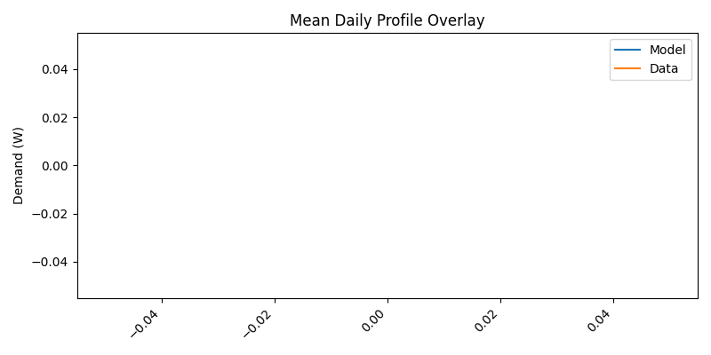
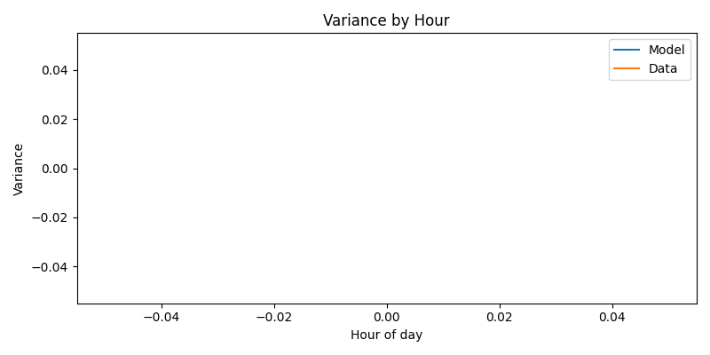
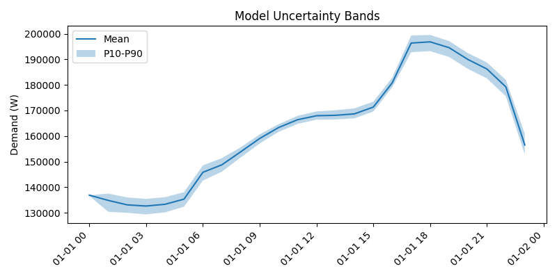

# Validation Report — Model v3

## Validation Type

- classification: explicit smart-meter diagnostic
- interpretation: Per-household smart-meter profile comparison against the configured reference dataset; intended for thesis-facing validation only when validation.smart_meter_path points to an independent dataset.

## Runtime Context

- canonical thesis config: `config/thesis.yaml`
- canonical thesis runtime: reference year `2023`, `30` households, `simulation.max_steps: null`, climate disabled
- report reference year: `2023`
- report cohort households: `10`
- report minimum households: `30`
- report max steps: `24`
- quick mode: `False`
- climate enabled: `True`
- simulated/aligned model steps: `24`

## Artifact Interpretation

- This artifact is horizon-limited by `simulation.max_steps`.
- It covers fewer than a full non-leap-year hourly horizon.
- The overall acceptance status must be read from the threshold table; mean agreement alone is not sufficient.

## Alignment

- model resolution (s): 3600
- data resolution (s): 1800
- target resolution (s): 3600
- matched timestamps: 0

## Mean accuracy

- MBE: 0.000000
- MAE: 0.000000
- RMSE: 0.000000
- CVRMSE: 0.000000

## Variance realism

- variance_model: 0.000000
- variance_data: 0.000000
- CV_model: 0.000000
- CV_data: 0.000000
- Levene_statistic: 0.000000
- Levene_p_value: 1.000000

## Distribution realism

- Anderson_Darling_statistic: 0.000000
- P10_error: 0.000000
- P50_error: 0.000000
- P90_error: 0.000000
- LDC plot: 

## Temporal structure

- Pearson_correlation: 0.000000
- autocorrelation_difference_mean: 0.000000
- autocorrelation_difference_max: 0.000000
- peak_timing_error_hours: 0.000000

## Event-based validation

- peak_day_error: 0.000000
- peak_MAE_kW: 0.000000
- extreme_condition_error: 0.000000

## Validation vs Literature Thresholds

| Metric | Model | Acceptable | Good | Status |
| --- | ---: | ---: | ---: | --- |
| MBE monthly | nan | <= 0.050 | - | FAIL |
| CVRMSE monthly | 0.000 | <= 0.150 | - | PASS |
| MBE hourly | nan | <= 0.100 | <= 0.050 | FAIL |
| CVRMSE hourly | 0.000 | <= 0.300 | <= 0.200 | PASS |
| Peak MAE (kW) | 0.000 | <= 0.200 | <= 0.100 | PASS |
| Quantile error P10 (kW) | 0.000 | <= 0.200 | <= 0.100 | PASS |
| Quantile error P90 (kW) | 0.000 | <= 0.200 | <= 0.100 | PASS |
| Overall | FAIL | all critical pass | - | FAIL |

## Visualisations

- Mean daily profile overlay: 
- Load duration curve: 
- Variance by hour: 
- Uncertainty bands: 

## Validation Independence / Data Role

- dataset_independent: False
- partial_overlap: True
- validation_independence: weak
- implications: Validation uses the same dataset path as at least one model input, so the result is not independent.

## Normalization / Calibration Caveat

The comparison uses the normalization audit below. Annual electricity is calibrated to the configured Belgian baseline, so this report tests profile agreement after that calibration rather than proving independent annual demand prediction.

## What this script does not validate

This script validates aggregate electricity demand against the configured smart meter reference profile. If the default LCL mean profile is used, the benchmark is real measured data but not independent from the representative load input source. It does not validate appliance disaggregation, occupant identity, or unobserved end-use attribution.

## Normalization Check

- comparison mode: per_household
- comparison unit: W_instantaneous
- model representation: per_household
- data representation: per_household
- normalization mode: absolute
- household count: 30
- model mean before scaling (W): nan
- data mean before scaling (W): nan
- model mean after scaling (W): nan
- data mean after scaling (W): nan
- relative mean difference: 0.000000
- scale check enforced: False
- scaling applied: none

## Cohort Diagnostics

- diversity factor: 1.000148
- peak mean (W): 196882.311363
- peak p90 (W): 199562.469224
- annual energy mean (kWh): 3900.000000

### Variance By Hour

- hour 00: 0.000000
- hour 01: 0.000000
- hour 02: 0.000000
- hour 03: 0.000000
- hour 04: 0.000000
- hour 05: 0.000000
- hour 06: 0.000000
- hour 07: 0.000000
- hour 08: 0.000000
- hour 09: 0.000000
- hour 10: 0.000000
- hour 11: 0.000000
- hour 12: 0.000000
- hour 13: 0.000000
- hour 14: 0.000000
- hour 15: 0.000000
- hour 16: 0.000000
- hour 17: 0.000000
- hour 18: 0.000000
- hour 19: 0.000000
- hour 20: 0.000000
- hour 21: 0.000000
- hour 22: 0.000000
- hour 23: 0.000000
