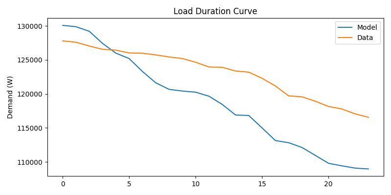
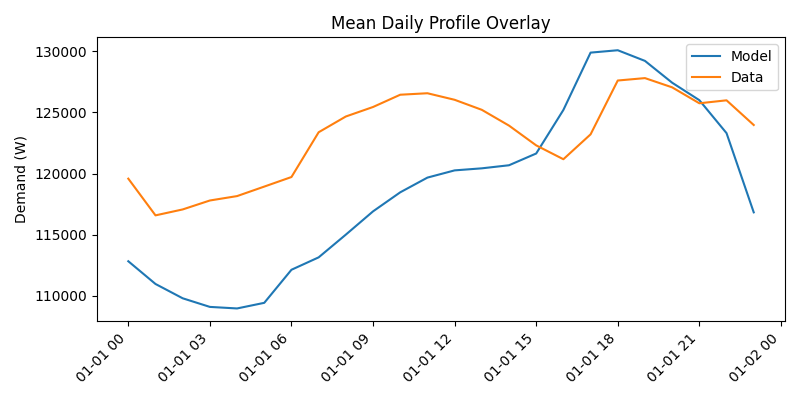
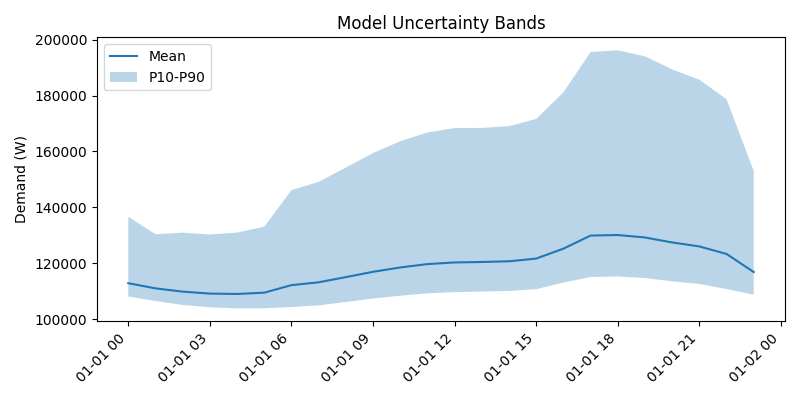

# Validation Report — Model v3

## Validation Type

- classification: internal consistency
- interpretation: Synthetic-reference comparison for runner and metric consistency; not an external validation claim.

## Runtime Context

- canonical thesis config: `config/thesis.yaml`
- canonical thesis runtime: reference year `2023`, `30` households, `simulation.max_steps: null`, climate disabled
- report reference year: `2023`
- report cohort households: `10`
- report minimum households: `30`
- report max steps: `24`
- quick mode: `False`
- climate enabled: `True`
- simulated/aligned model steps: `24`

## Artifact Interpretation

- This artifact is horizon-limited by `simulation.max_steps`.
- It covers fewer than a full non-leap-year hourly horizon.

## Alignment

- model resolution (s): 3600
- data resolution (s): 3600
- target resolution (s): 3600
- matched timestamps: 24

## Mean accuracy

- MBE: -4452.855534
- MAE: 5720.856115
- RMSE: 6495.541785
- CVRMSE: 5.276879

## Variance realism

- variance_model: 48503221.002999
- variance_data: 12849559.768014
- CV_model: 0.058701
- CV_data: 0.029121
- Levene_statistic: 11.344578
- Levene_p_value: 0.001538

## Distribution realism

- Anderson_Darling_statistic: 4.132008
- P10_error: -8356.735894
- P50_error: -4873.941493
- P90_error: 1771.134515
- LDC plot: 

## Temporal structure

- Pearson_correlation: 0.761395
- autocorrelation_difference_mean: 0.493019
- autocorrelation_difference_max: 1.069957
- peak_timing_error_hours: 1.000000
- diversity_factor_model: 1.000243

## Event-based validation

- peak_day_error: 2276.350607
- peak_MAE_kW: 2.276351
- extreme_condition_error: 2277.561380
- coldest_day_count: 1.000000
- peak_day_count: 1.000000

## Validation vs Literature Thresholds

| Metric | Model | Acceptable | Good | Status |
| --- | ---: | ---: | ---: | --- |
| MBE monthly | -0.036 | <= 0.050 | - | PASS |
| CVRMSE monthly | 0.036 | <= 0.150 | - | PASS |
| MBE hourly | -0.036 | <= 0.100 | <= 0.050 | PASS |
| CVRMSE hourly | 0.053 | <= 0.300 | <= 0.200 | PASS |
| Peak MAE (kW) | 2.276 | <= 0.200 | <= 0.100 | FAIL |
| Quantile error P10 (kW) | 8.357 | <= 0.200 | <= 0.100 | FAIL |
| Quantile error P90 (kW) | 1.771 | <= 0.200 | <= 0.100 | FAIL |
| Overall | FAIL | all critical pass | - | FAIL |

## Visualisations

- Mean daily profile overlay: 
- Load duration curve: 
- Variance by hour: 
- Uncertainty bands: 

## Validation Independence / Data Role

- dataset_independent: False
- partial_overlap: True
- validation_independence: weak
- implications: Synthetic validation is useful for framework checks but not for external realism.

## What this script does not validate

This script validates the validation pipeline itself against a synthetic benchmark. It does not validate external measured-load calibration, appliance-level end uses, or long-run seasonal behaviour.
